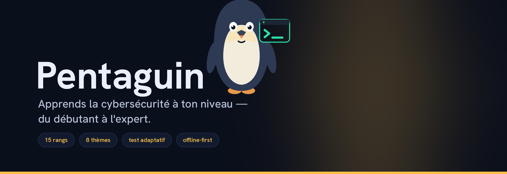
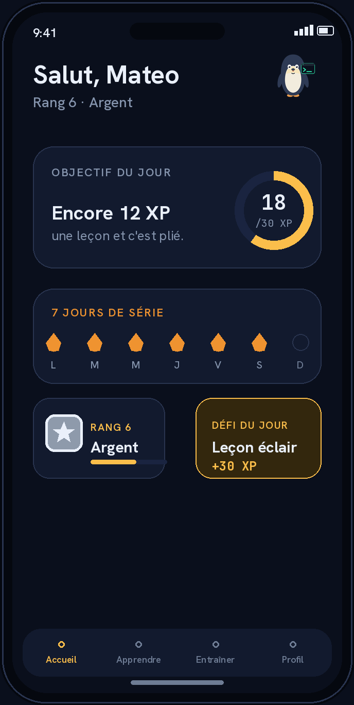
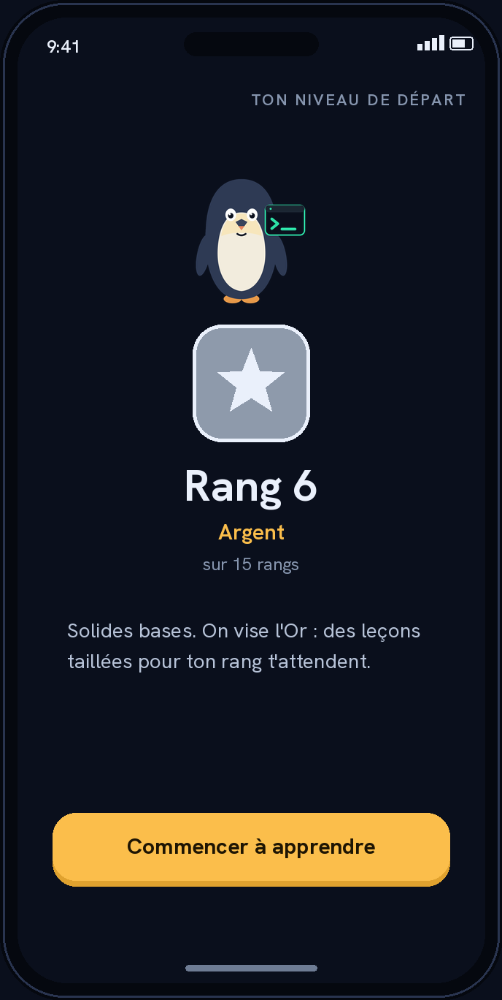
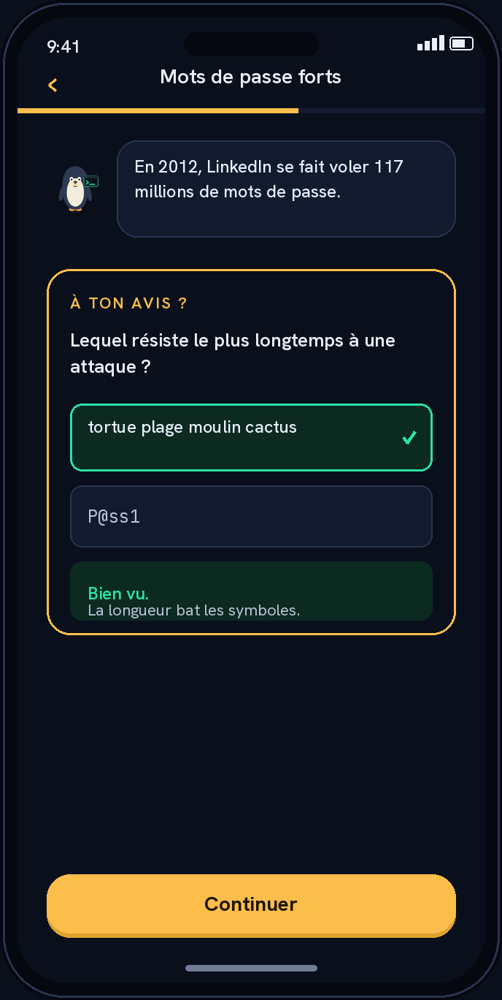
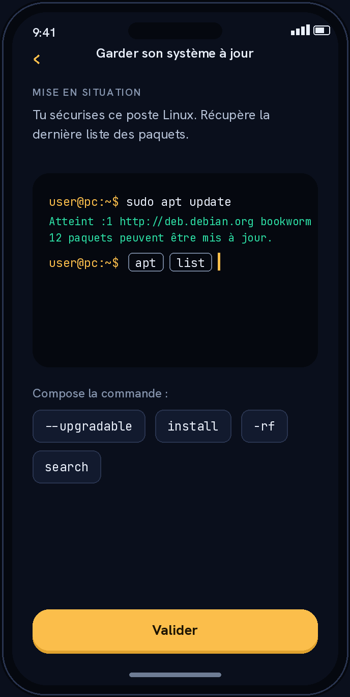
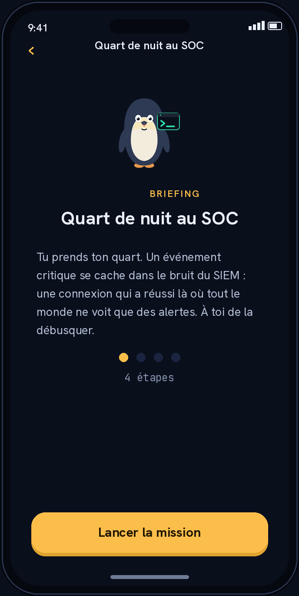
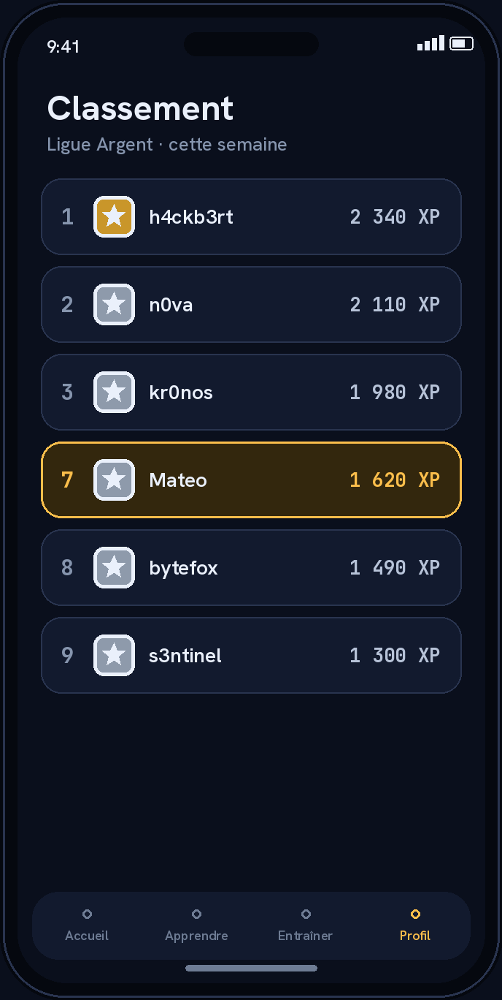

<p align="center">
  
</p>

<p align="center">
  <a href="https://github.com/mateo-brl/Pentaguin/actions/workflows/ci.yml"></a>
  
  
  
  
</p>

**Pentaguin** est une application mobile de révision et d'entraînement en
cybersécurité. Un **test de positionnement adaptatif** situe ton niveau parmi
**15 rangs**, puis l'app t'oriente vers des **leçons interactives**, de la
**pratique en situation** et un **classement**. Le tout **offline-first**,
gamifié, en **français** (avec la terminologie technique anglaise) et **anglais**.

> Pentaguin est une application indépendante. CompTIA®, Security+® et les autres
> marques citées appartiennent à leurs propriétaires respectifs ; aucune
> affiliation ni approbation n'est revendiquée.

---

## 📱 Aperçu

<table>
  <tr>
    <td align="center" width="33%"><br><sub><b>Accueil</b> — objectif du jour, série, rang</sub></td>
    <td align="center" width="33%"><br><sub><b>Test de niveau</b> — placé parmi 15 rangs</sub></td>
    <td align="center" width="33%"><br><sub><b>Leçon</b> — on parie avant d'apprendre</sub></td>
  </tr>
  <tr>
    <td align="center" width="33%"><br><sub><b>Terminal à jetons</b> — pratique sans clavier</sub></td>
    <td align="center" width="33%"><br><sub><b>Mission</b> — enquête guidée, étape par étape</sub></td>
    <td align="center" width="33%"><br><sub><b>Classement</b> — XP hebdomadaire par ligue</sub></td>
  </tr>
</table>

<p align="center"><sub><i>Maquettes générées à partir du design system réel de l'app (couleurs, polices Hanken/JetBrains Mono, mascotte).</i></sub></p>

---

## ✨ Fonctionnalités

- **Test de positionnement adaptatif** — 20 questions tirées d'une banque de
  **450** (30 par niveau de difficulté). Moteur en escalier asymétrique qui
  corrige le biais de devinette des QCM : erreur moyenne mesurée **~0,7 rang**,
  à ±1 rang dans la grande majorité des cas (mesuré par simulation).
- **15 rangs** — Bronze → Argent → Or → Platine, puis Diamant, Maître, Empereur 🐧.
- **Leçons interactives** — 8 thèmes (Fondamentaux, Réseaux, Cryptographie, Web,
  Systèmes & AD, Menaces & malwares, Défense/SOC, Offensive), **64 leçons** qui
  se jouent bloc par bloc : le manchot ouvre sur un fait réel, tu **paries avant
  d'apprendre** (« à ton avis ? »), tu démontes les idées reçues en vrai/faux, tu
  retournes des cartes. Chaque leçon porte un niveau 1-15 : l'onglet Apprendre
  met en avant celles **de ton rang**.
- **Pratique en situation** — 4 types d'exercices (un **terminal à jetons** qu'on
  compose sans clavier, analyse d'artefacts, remise en ordre, scénarios à choix)
  et **8 missions scénarisées** qui les enchaînent en enquêtes : briefing →
  étapes → rapport de mission.
- **Rétention** — objectif du jour, série avec **boucliers**, paliers célébrés,
  rappel quotidien personnalisé et récap hebdomadaire.
- **Comptes & sécurité** — connexion obligatoire (Sign in with Apple / e-mail),
  vérification d'e-mail, **2FA TOTP**, avatars, réglages (langue, thème, notifs).
- **Classement** — XP quotidien et rang synchronisés, ligues.
- **Offline-first** — l'essentiel vit sur l'appareil (SQLite) ; le compte sert
  d'identité de classement et de synchronisation.
- **Monétisation douce** — freemium généreux (thèmes fondateurs gratuits), achat
  unique isolé et désactivable ; pas de dark patterns.

---

## 🧱 Stack

**App** : Expo SDK 57 (managed) · React Native · TypeScript · expo-router ·
Zustand · expo-sqlite · contenu JSON validé par Zod.

**Backend** (classement, comptes, télémétrie) : **Node 22 pur, zéro dépendance
npm** (`node:http`, `node:sqlite`, `node:crypto`), derrière nginx + WAF, sur
`mateobrl.fr`. Voir [`backend/`](backend/).

**Livraison** : buildé et publié **depuis Linux, sans Mac**, via GitHub Actions
(runner `macos-26`, `eas build --local`) et **mises à jour OTA** (EAS Update).

---

## 🚀 Démarrer

```bash
npm install
npx expo start        # Expo Go ou dev build
```

Scripts qualité (tous exécutés en CI) :

```bash
npm run typecheck        # tsc --noEmit
npm run lint             # expo lint
npm test                 # jest
npm run validate:content # schémas Zod + cohérence + placement + parité FR/EN
```

---

## 🗂️ Structure

```
src/app/                  # routes expo-router (fines, sans logique métier)
  (app)/                  # tout l'app déverrouillé (garde de session + rang)
  sign-in, choose-pseudo, onboarding, placement/  # parcours d'entrée
src/components/           # composants thémés partagés (Button, Row, Penguin, RankBadge…)
src/content/              # CONTENU = DONNÉES (packs JSON + schémas Zod + placement/ + practice/)
src/features/             # logique par domaine
  account/ rank/ placement/ lessons/ practice/ gamification/
  monetization/ (isolée) telemetry/ settings/…
src/theme/                # design system 3 niveaux (primitives → sémantique → composant)
src/i18n/                 # chaînes UI (fr/en)
content-tools/            # validation du contenu
backend/                  # API Node pur + déploiement systemd/nginx
docs/                     # AUTHORING, DESIGN-SYSTEM, PLAN-RANGS, ASO, APP-STORE, BACKUP…
```

---

## 📚 Contenu pédagogique

Le contenu **est de la donnée, jamais du code** : leçons, questions, banque de
positionnement et exercices vivent en JSON sous `src/content/`, validés par Zod
(`npm run validate:content`, exécuté en CI — schémas, cohérence référentielle et
**parité FR/EN**). Format et règles :
**[docs/AUTHORING-LESSONS.md](docs/AUTHORING-LESSONS.md)**.

Chaque leçon = une suite de blocs (accroche, pari d'intuition, texte, encadré,
vrai/faux, cartes, question de vérification) + un `level` 1-15 qui pilote
l'orientation par rang. Design de l'app : **[docs/DESIGN-SYSTEM.md](docs/DESIGN-SYSTEM.md)**.

---

## 🔄 CI / Release

- **CI** ([`.github/workflows/ci.yml`](.github/workflows/ci.yml)) — typecheck, lint,
  tests, validation du contenu, sur chaque push/PR. Sans secret.
- **iOS build** ([`.github/workflows/ios-build.yml`](.github/workflows/ios-build.yml))
  — `.ipa` via `eas build --local` sur runner `macos-26` (gratuit sur repo public,
  ne consomme pas le quota EAS), puis upload TestFlight (fastlane). Approbation
  manuelle requise.
- **OTA** ([`.github/workflows/ota-update.yml`](.github/workflows/ota-update.yml))
  — publie le bundle JS/contenu sans rebuild natif.

> ⚠️ **Repo public** : aucun secret committé. Tout passe par GitHub Secrets côté
> CI et `/etc/pentaguin/env` côté serveur.

---

## 🐧 Pourquoi « Pentaguin »

Penetration testing + penguin. Construit sur Linux, servi par un backend Linux,
et guidé par un manchot empereur qui grimpe les rangs avec toi.
